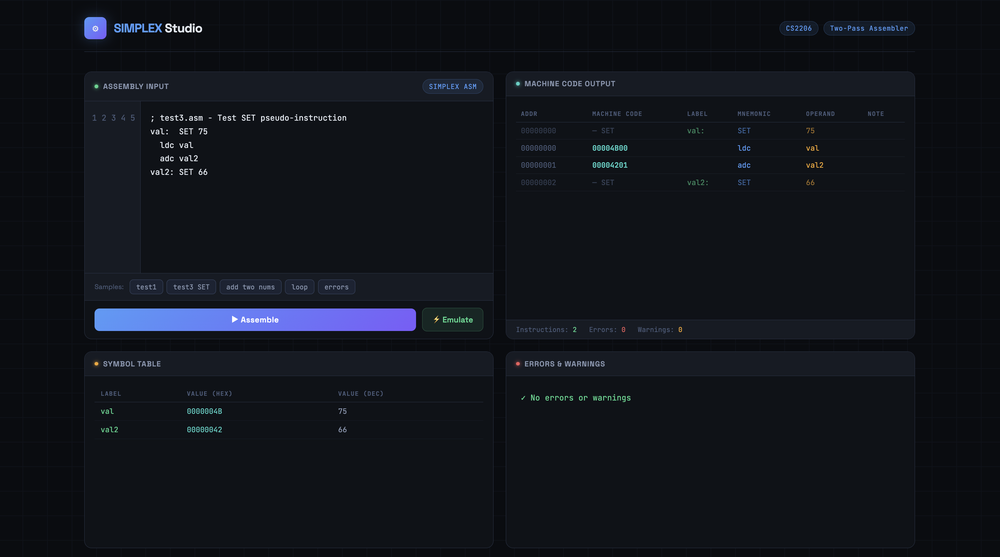
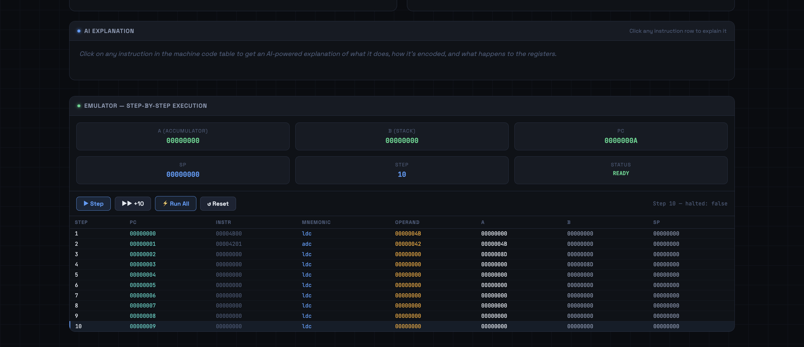

# SIMPLEX Assembler & Emulator

<div align="center">


[](https://mohithchandra07.github.io/simplex-assembler-emulator/)

<br/>

**A complete two-pass assembler and emulator built from scratch for the SIMPLEX Instruction Set Architecture, plus an interactive browser-based IDE with AI-powered instruction explanations.**

<br/>

*Mohith Chandra Gugulothu · 2403cs04 · CS2206 Computer Architecture · IIT Patna*

</div>

---

## What is this project?

The **SIMPLEX ISA** is a minimal 32-bit instruction set architecture. This project builds the entire software toolchain for it from scratch:

- You write assembly code in SIMPLEX assembly language
- The **assembler** (`asm.cpp`) reads your `.asm` file and produces a binary object file (`.o`) along with a human-readable listing and error log
- The **emulator** (`emu.cpp`) loads that binary and actually executes it, showing you how registers and memory change at every step
- The **SIMPLEX Studio** web app lets you do all of the above directly in your browser, with a live symbol table, machine code table, step-by-step emulator, and an AI panel that explains any instruction you click on

Everything is written from scratch in C++ (CLI tools) and vanilla HTML/JS (web app) — no external libraries or frameworks.

---

## Table of Contents

- [SIMPLEX Studio — Web App](#-simplex-studio--web-app)
- [Screen Recording](#-screen-recording)
- [How the Assembler Works](#-how-the-assembler-works)
- [How the Emulator Works](#-how-the-emulator-works)
- [All Test Programs](#-all-test-programs)
- [Repository Structure](#-repository-structure)
- [Build & Run](#-build--run)
- [Claims Document](#-claims-document)
- [License](#-license)

---

## 🌐 SIMPLEX Studio — Web App

A fully interactive browser-based IDE for SIMPLEX assembly — no installation, no server, just open the HTML file and go.

### Screenshots

**Assembler Panel** — type or paste any SIMPLEX assembly program. The machine code output table, symbol table, and error/warning panel update instantly after you hit Assemble.



**Emulator Panel** — after assembling, switch to the emulator. Step through instructions one at a time or run all at once. Every register (A, B, SP, PC) is shown live. Click any instruction row to get an **AI-powered explanation** of exactly what that instruction does, how it is encoded in binary, and what changes in the registers.



### Features at a Glance

| Panel | What it does |
|---|---|
| Assembly Input | Write SIMPLEX assembly with line numbers; 5 built-in sample programs included |
| Machine Code Output | Full table — address, machine code word (hex), label, mnemonic, operand, notes |
| Symbol Table | Every label with its value in both hex and decimal |
| Errors & Warnings | Every error and warning listed with descriptions and line numbers |
| Emulator | Step / +10 / Run All / Reset controls; live A, B, SP, PC register display |
| Execution Trace | Full table of every step — PC, instruction word, mnemonic, operand, register states |
| 🤖 AI Explanation | Click any instruction row → AI explains what it does and why |

### How to open it

## 🚀 Try it live — no installation needed

👉 **[Open SIMPLEX Studio](https://mohithchandra07.github.io/simplex-assembler-emulator/)**

Or run locally:
```bash
git clone https://github.com/MohithChandra07/simplex-assembler-emulator.git
cd simplex-assembler-emulator
open index.html
```

```bash
git clone https://github.com/MohithChandra07/simplex-assembler-emulator.git
cd simplex-assembler-emulator

# macOS
open "<!DOCTYPE html>.html"

# Windows
start "<!DOCTYPE html>.html"

# Linux
xdg-open "<!DOCTYPE html>.html"
```

No internet required — except for the AI explanation feature.

---

## 🎬 Screen Recording

<!-- 
  TO ADD YOUR VIDEO:
  Upload to Google Drive → Share → "Anyone with the link" → paste link below
  OR upload to YouTube (Unlisted is fine) → paste the URL below
-->

[](https://youtu.be/ZyZ6gSziXzk)

The recording walks through the entire project end to end — compiling the assembler and emulator, running all the test programs, inspecting output files, and a live demo of SIMPLEX Studio in the browser.

---

## 🔧 How the Assembler Works

The assembler is a classic **two-pass** design implemented entirely in `asm.cpp`.

### Pass 1 — Build the Symbol Table
The assembler reads every line of the `.asm` file without generating code. It tracks the program counter, records every label and the address it points to, and processes `SET` pseudo-instructions (which assign a value to a label without emitting any machine code). By the end of pass 1, every label in the entire program is known — including ones defined after they are first used (forward references).

### Pass 2 — Generate Machine Code
The assembler reads every line again. This time it encodes each instruction into a 32-bit machine word using the opcode table and the symbol table built in pass 1. Forward references are now fully resolved. Three output files are written:

| Output file | Contents |
|---|---|
| `<name>.lst` | Listing file — address, hex machine code word, original assembly line |
| `<name>.log` | Log file — same as listing, with all errors and warnings appended |
| `<name>.o` | Binary object file — raw 32-bit words ready for the emulator |

If there are any errors, the `.o` file is not produced. Lines with errors are skipped; all other lines are still assembled and appear in the listing.

### Error and Warning Detection

The assembler catches and reports every one of the following, with the exact line number:

| Category | Errors detected |
|---|---|
| Labels | Duplicate label definition, invalid label name (bad characters), undefined label at end of pass 2 |
| Operands | Missing operand where one is required, unexpected operand where none is allowed, extra text after a valid operand |
| Instructions | Invalid / unknown mnemonic |
| Numbers | Invalid numeric constant (not valid decimal / octal / hex) |
| SET | `SET` used without a label, `SET` used without a value |
| Warnings | Label declared but never referenced anywhere in the program |
| Warnings | Data directive (`data`) with no label (the word is unreachable) |

### Numeric constant formats supported

```
42        decimal
052       octal  (leading zero)
0x2A      hexadecimal
```

---

## ⚙️ How the Emulator Works

The emulator (`emu.cpp`) loads a `.o` binary into a 65,536-word memory array and executes it instruction by instruction, exactly following the SIMPLEX specification for all **19 opcodes (0–18)**.

### Registers

| Register | Role |
|---|---|
| A | Accumulator — primary arithmetic and logic register |
| B | Secondary / stack top register |
| SP | Stack pointer |
| PC | Program counter |

### Output files — selected with `-o` followed by any combination of digits

| Flag digit | File produced | Contents |
|---|---|---|
| `1` | `.trace` | One line per instruction: PC, raw instruction word, mnemonic, operand, A, B, SP before execution |
| `2` | `.memdump` | Final memory contents printed 4 words per line (up to last non-zero word), plus final register values |
| `3` | `.before` | A, B, SP, PC before each instruction |
| `4` | `.after` | A, B, SP, PC after each instruction |

If you pass no `-o` flag, `.trace` is produced by default. You can combine digits freely — `-o 1234` produces all four files at once.

### Safety checks

The emulator detects and stops with an error message on:
- Program counter going out of bounds
- Unknown / unrecognised opcode
- Probable infinite loop (execution exceeds 11 million instructions)

---

## 🧪 All Test Programs

Eight assembly programs are included, covering everything from basic instructions to complex algorithms and deliberate error cases.

---

### Sum of the first N integers
**File:** `test5.asm`

Adds up all integers from 1 to N using a loop. For N = 10 the result is **55**.

```
Result after emulation:  0x00000037  (decimal 55)  ✓
Assembler:  0 errors · 0 warnings
```

---

### Multiplication by repeated addition
**File:** `test6.asm`

Computes A × B by adding A to itself B times. Demonstrates loops and counter decrement. For 6 × 7 the result is **42**.

```
Result after emulation:  0x0000002A  (decimal 42)  ✓
Assembler:  0 errors · 0 warnings
```

---

### Triangle numbers — recursive program
**File:** `test4.asm`

Computes the N-th triangle number (sum of 1 + 2 + … + N) using a recursive subroutine. For N = 10 the result is **55**. Exercises the call stack, `call`, `return`, and stack pointer manipulation.

```
Result after emulation:  0x00000037  (decimal 55)  ✓
Assembler:  0 errors · 0 warnings
```

---

### Bubble sort
**File:** `test9.asm`

Sorts an array of 10 integers using the bubble sort algorithm. After emulation the array in memory is fully sorted in ascending order. This is the most complex test — many labels, nested loops, and conditional branches.

```
Array after emulation:  [0, 1, 2, 3, 4, 5, 6, 7, 8, 9]  ✓
Assembler:  0 errors · 0 warnings
```

---

### SET pseudo-instruction
**File:** `test3.asm`

Tests the `SET` directive, which assigns a constant value to a label without emitting any machine code. Verifies that the assembler correctly substitutes SET values into instructions that reference those labels.

```
val  SET 75   →   ldc val   loads 75 into A
val2 SET 66   →   adc val2  adds 66 → A = 141 (0x8D)
Result after emulation:  A = 0x0000008D  ✓
Assembler:  0 errors · 0 warnings
```

---

### Forward reference and loop
**File:** `test1.asm`

Tests that the two-pass assembler correctly resolves a label that is used before it is defined (forward reference). Also contains an infinite loop and a label that is defined but never used, which should produce exactly one warning.

```
Assembler:  0 errors · 1 warning (unused label)  ✓
Branch offset resolved correctly  ✓
```

---

### Error detection
**File:** `test2.asm`

A program deliberately full of mistakes — used to verify that the assembler catches every type of error correctly and reports them all with the right line numbers.

```
Assembler detects:  9 errors (duplicate label, undefined label, invalid number,
                    missing operand, unexpected operand, extra text,
                    invalid label name, two unknown mnemonics)
No object file produced  ✓
```

---

### Deliberate errors and warnings
**File:** `test8.asm`

A more comprehensive error test. Contains both error lines and valid lines mixed together — verifying that the assembler continues past errors and still assembles the valid parts into a listing.

```
Assembler detects:  8 errors · 2 warnings
Valid lines assembled and appear in listing  ✓
No object file produced  ✓
```

---

## 📁 Repository Structure

```
simplex-assembler-emulator/
│
├── Programmings/
│   ├── asm.cpp                  ← Two-pass assembler source
│   ├── emu.cpp                  ← Emulator source
│   ├── Machine code.cpp         ← Machine code generation helper
│   ├── Symbol table.cpp         ← Symbol table helper
│   ├── asm                      ← Compiled assembler binary (Linux)
│   ├── emu                      ← Compiled emulator binary (Linux)
│   ├── test.asm
│   ├── test1.asm  ←─ forward reference / unused label / loop
│   ├── test2.asm  ←─ error detection (9 errors)
│   ├── test3.asm  ←─ SET pseudo-instruction
│   ├── test4.asm  ←─ recursion – triangle numbers
│   ├── test5.asm  ←─ sum of first N integers
│   ├── test6.asm  ←─ multiplication by repeated addition
│   ├── test8.asm  ←─ deliberate errors and warnings
│   └── test9.asm  ←─ bubble sort
│
├── Tests/
│   ├── Bubble sort/             ← .lst .log .o .trace .after output files
│   ├── Error test/
│   ├── Multiply two numbers using repeated addition/
│   ├── Sum of first N numbers/
│   ├── test1/
│   ├── test2/
│   ├── test3/
│   └── test4/
│
├── <!DOCTYPE html>.html         ← SIMPLEX Studio web app (open in browser)
├── Commands.rtf                 ← Quick reference for all CLI commands
├── claims.txt                   ← Plain text authorship claims
├── Claims.pdf                   ← Full formatted claims document (PDF)
├── assets/
│   ├── demo1.png                ← Web app assembler screenshot
│   └── demo2.png                ← Web app emulator screenshot
└── README.md
```

---

## 🛠 Build & Run

### Requirements
- `g++` (any version supporting C++11 or later)
- Any modern browser for the web app

### Assembler

```bash
# Compile
g++ asm.cpp -o asm

# Run on any .asm file
./asm test5.asm

# Output produced (if no errors):
#   test5.lst   — listing file
#   test5.log   — log with errors/warnings
#   test5.o     — binary object file
```

### Emulator

```bash
# Compile
g++ emu.cpp -o emu

# Run — produces trace file by default
./emu test5.o

# Run with specific outputs
./emu test5.o -o 1       # trace only
./emu test5.o -o 2       # memory dump only
./emu test5.o -o 14      # trace + after-state
./emu test5.o -o 1234    # all four output files

# Run multiple object files in one go
./emu test4.o test5.o test6.o -o 2
```

> **Note:** The `.asm` / `.o` file must be in the same directory as the binary when you run it.

---

## 📄 Claims Document

Full authorship declaration and detailed testing evidence:

| Format | File |
|---|---|
| Plain text | [`claims.txt`](./claims.txt) |
| Formatted PDF | [`Claims.pdf`](./Claims.pdf) |

---

## 📜 License

```
MIT License — Copyright (c) 2026 Mohith Chandra Gugulothu

Permission is hereby granted, free of charge, to any person obtaining a copy
of this software and associated documentation files (the "Software"), to deal
in the Software without restriction, including without limitation the rights
to use, copy, modify, merge, publish, distribute, sublicense, and/or sell
copies of the Software, and to permit persons to whom the Software is
furnished to do so, subject to the following conditions:

The above copyright notice and this permission notice shall be included in all
copies or substantial portions of the Software.

THE SOFTWARE IS PROVIDED "AS IS", WITHOUT WARRANTY OF ANY KIND, EXPRESS OR
IMPLIED, INCLUDING BUT NOT LIMITED TO THE WARRANTIES OF MERCHANTABILITY,
FITNESS FOR A PARTICULAR PURPOSE AND NONINFRINGEMENT. IN NO EVENT SHALL THE
AUTHORS OR COPYRIGHT HOLDERS BE LIABLE FOR ANY CLAIM, DAMAGES OR OTHER
LIABILITY, WHETHER IN AN ACTION OF CONTRACT, TORT OR OTHERWISE, ARISING FROM,
OUT OF OR IN CONNECTION WITH THE SOFTWARE OR THE USE OR OTHER DEALINGS IN
THE SOFTWARE.
```

---

<div align="center">

**Mohith Chandra Gugulothu · 2403cs04**
CS2206 Computer Architecture · IIT Patna

</div>
